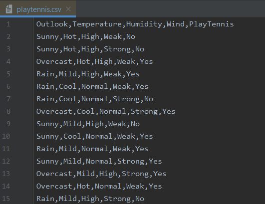
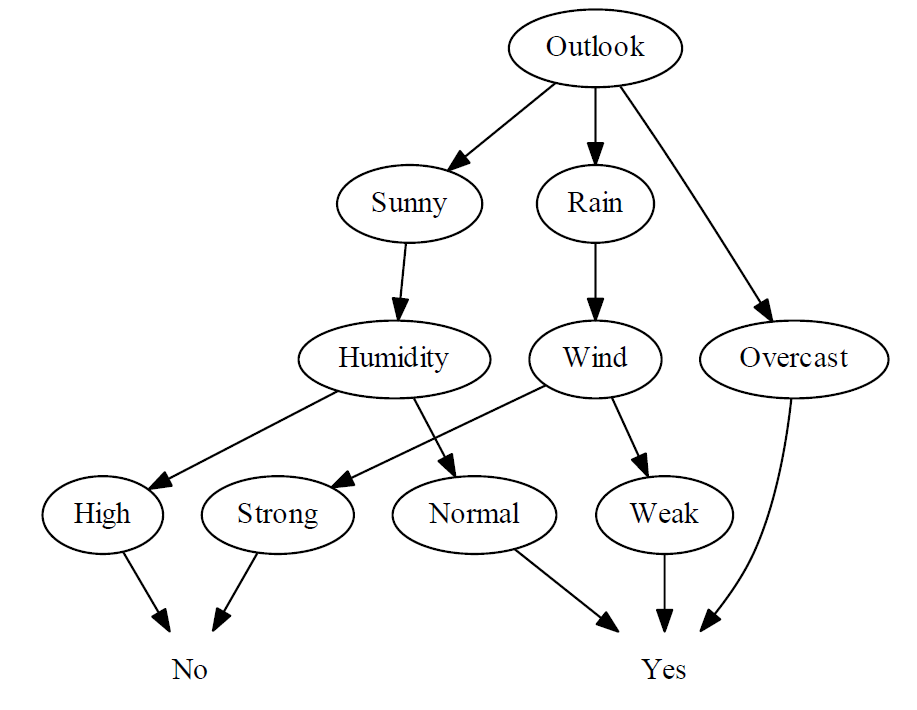

# DecisionTreeGenerator

**This application can develop a decision tree from a training data set containing categorical attributes and a class label. In the example below, Outlook, Temperature, Humidity, and Wind are the categorical attributes (inputs). PlayTennis is the class label (output).
The objective is to create a decision tree so we can make predictions on what the class label (output) will be, given a set of categorical attribute values (inputs)**

**The decision tree below was modeled using the ID3 algorithm.**

